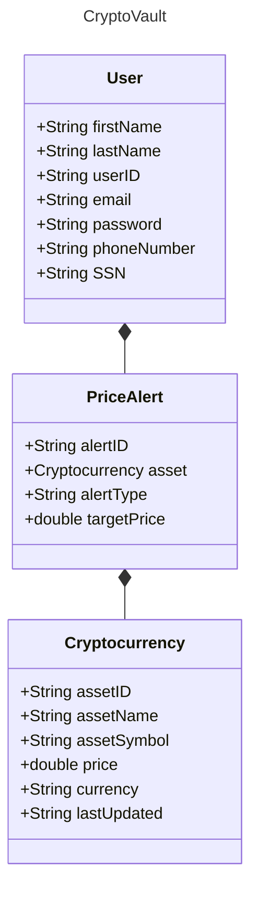

CryptoVault - Cryptocurrency Tracker

CryptoVault is a comprehensive Progressive Web Application (PWA) that allows users to track cryptocurrency market prices, monitor market trends, and receive real-time price alerts. The application provides a seamless experience across desktop and mobile devices with offline capabilities.

## 🚀 Key Features

### Cryptocurrency Tracking
- Real-time price updates 
- Price-alert system that uses target prices

### User Features
- Secure JWT-based authentication system
- Customizable price alerts and notifications
- English/Spanish language supports
- Real-time cryptocurrency price updates

## 🛠️ Technical Stack

### Frontend
- Redux for state management
- React Router for navigation
- Progressive Web App (PWA) capabilities
- Responsive design using CSS Grid/Flexbox

### Backend
- REST API server
- Express.js
- MongoDB database
- JWT authentication
- Real-time data integration with cryptocurrency APIs
- Bruno for testing
- Cors
- Debug
- dotenv

## 📱 API Endpoints

/user          - User management operations
/cryptoprices  - Cryptocurrency price list
/pricealerts    - Price alert configurations
/auth          - Authentication endpoints

## 💻 System Requirements

### Prerequisites
- Node.js 14.x or higher
- MongoDB 4.x or higher
- Modern web browser with JavaScript enabled

### Development Setup
1. Clone the repository
2. Switch to API: cd app
3. Install dependencies: npm init
4. Install run all: npm install npm-run-all --save-dev
5. Configure environment variables
6. Start development server: npm run dev (the API will run on PORT 3002 and app on PORT 3000)

## 🔒 Security Features
- JWT-based secure authentication
- Protected API endpoints
- Encrypted user data
- Secure password handling

## 📱 Progressive Web App Features
- Offline functionality
- Push notifications
- Fast loading and performance

## 🎨 User Interface
- Responsive design
- Intuitive navigation
- Dark/Light mode support
- Real-time data updates

## 📊 Data Integration
- Real-time cryptocurrency price data
- Portfolio performance tracking

## Domain Model
# Domain Model for CryptoVault (Cryptocurrency Tracker)

## Link to our presenttion
- Video Presentation: https://northeastern-my.sharepoint.com/:v:/r/personal/lerdwanawattana_n_northeastern_edu/Documents/Recordings/Call%20with%20Jialun%20and%202%20others-20241207_172700-Meeting%20Recording.mp4?csf=1&web=1&e=eon3Zp
- PPT : https://www.canva.com/design/DAGYoDVJXtw/iy8doH4FkRMROxDRsN60HQ/edit?utm_content=DAGYoDVJXtw&utm_campaign=designshare&utm_medium=link2&utm_source=sharebutton

## 👥 Authors
- Natnicha Lerdwanawattana - lerdwanawattana.n@northeastern.edu
- Tirth Naik - naik.ti@northeastern.edu
- Jialun Tang - tang.jial@northeastern.edu
- Omisha Kataria - kataria.o@northeastern.edu
